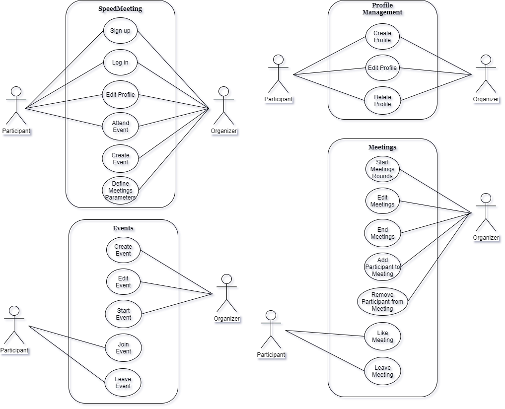

# openCX - *SpeedMeeting* Development Report

Welcome to the documentation pages of the *SpeedMeeting* of **openCX**!

You can find here details about the (sub)product, hereby mentioned as module, from a high-level vision to low-level implementation decisions, a kind of Software Development Report (see [template](https://github.com/softeng-feup/open-cx/blob/master/docs/templates/Development-Report.md)), organized by discipline (as of RUP): 

* Business modeling 
  * [Product Vision](#Product-Vision)
  * [Elevator Pitch](#Elevator-Pitch)
* Requirements
  * [Use Case Diagram](#Use-case-diagram)
  * [User stories](#User-stories)
  * [Domain model](#Domain-model)
* Architecture and Design
  * [Logical architecture](#Logical-architecture)
  * [Physical architecture](#Physical-architecture)
  * [Prototype](#Prototype)
* [Implementation](#Implementation)
* [Test](#Test)
* [Configuration and change management](#Configuration-and-change-management)
* [Project management](#Project-management)

So far, contributions are exclusively made by the initial team, but we hope to open them to the community, in all areas and topics: requirements, technologies, development, experimentation, testing, etc.

Please contact us! 

Thank you!

*Allan Borges de Sousa | 201800149*

*Alexandre Almeida de Abreu Filho |	201800168*

*Deborah Marques Lago | 201806102*

*João Francisco de Pinho Brandão | 201705573*

*Raúl Manuel Fidalgo da Silva Teixeira Viana | 201208089*

---

## Product Vision
Automated, dynamic, simple and unexpected way to unite people with similar professional interests in an online meeting room. You may not know who you are going to meet in the next round, but it might be your perfect match!

---
## Elevator Pitch

SpeedMeeting is a mobile app that makes the experience of networking and of attending online meetings more interesting, dynamic and automated. As a SpeedMeeting user you will be able to join an event or to create your own, leaving it to us to pair up the participants with similar interests in private meetings where you can interact through the text chat or though a videocall. All meeting rounds have determinated duration and when the time is up you will be automatically redirected to a new meeting. SpeedMeeting also allows you to like the best meetings you have had so you can contact the other participants and scale up your networking! If you are either an event organizer or an event participant, this is app is the next big thing in terms of online events!

---
## Requirements

### Use case diagram 

**Create Profile**

* **Actor**. Event Organizer/Event Participant 
* **Description**. This use case is needed so the user can start using the app, both for creating events or attending them. After creating of the profile, the user can edit his/her profile.
* **Preconditions and Postconditions**. When the user opens the app, there's a Welcome page that only appears for a short while, and then, the user will see page where he/she can Sign up or Log in. To create his/her profile, the user needs to click on the Sign Up button. After completing the form with his/her information, the user will be added to the database and automatically be logged in. After completing the form with his/her information, the user will be leaded to a page where he/she can either Create or Participate in an Event, Edit Profile or Edit Event.

* **Normal Flow**. 

  *i.* The user presses the button "Sign up" to create his/her profile;

  *ii.* The user fills the form with his/her personal information (Name, E-mail, Social Media profile of preference);

  *iii.* The user selects at least 3 tags that represent his/her interests (máx. 10);

  *iv.* The user confirms his/her register clicking on the "Done" button;

  *v.* If the informations are in the correct form, the user profile is saved on the database;

  *vi.* The user is redirected to the Options Menu.
 
* **Alternative Flows and Exceptions**. 

  *i.* The user presses the button "Sign up" to create his/her profile;

  *ii.* The user fills the form with his/her personal information (Name, E-mail, Social Media profile of preference);

  *iii.* The user selects only 2 tags of his/her interests;

  *iv.* The system will show an error message saying the user needs to select at least 3 tags.

  *v.* After selecting the 3 tags or more, the message disappears and the user can proceed as normal.

  *OR*

  *i.* The user presses the button "Sign up" to create his/her profile;

  *ii.* The user fills the form with his/her personal information (Name, E-mail, Social Media profile of preference);

  *iii.* If the provided E-mail is not in the correct form, the system will show an error message saying that the E-mail is not valid;

  *iv.* After retyping his/her E-mail int he correct form, the message disappears and the user can proceed as normal.

**Edit Profile**

* **Actor**. Event Organizer/Event Participant 
* **Description**. This use case is needed so the user can update his/her information at anytime. 
* **Preconditions and Postconditions**. When the user finishes creating his/her profile, he will be directed to the Options Menu, where he can find the button named "Edit Profile". To update his/her profile information, the user can press this button and make the changes. After updating the profile, the user will be directed again to the Options Menu.

* **Normal Flow**. 

  i. The user presses the button "Edit Profile" to update his/her profile;

  ii. The user re-enters the information he/she wants to update (Name, E-mail or Social Media profile of preference);

  iii. The user changes the 3 tags that represent his/her interests (máx. 10);

  iv. The user confirms his/her update register clicking on the "Done" button;

  v. If the informations are in the correct form, the user updated profile is saved again on the database;

  vi. The user is redirected to the Options Menu.
 
* **Alternative Flows and Exceptions**. 

  i. The user presses the button "Edit Profile" to update his/her profile;

  ii. The user re-enters the information he/she wants to update (Name, E-mail or Social Media profile of preference);

  iii. The user selects only 2 tags of his/her interests;

  iv. The system will show an error message saying the user needs to select at least 3 tags.

  v. After selecting the 3 tags or more, the message disappears and the user can proceed as normal.

  *OR*

  i. The user presses the button "Edit Profile" to update his/her profile;

  ii. The user re-enters the information he/she wants to update (Name, E-mail or Social Media profile of preference);

  iii. If the new provided E-mail is not in the correct form, the system will show an error message saying that the E-mail is not valid;

  iv. After retyping his/her E-mail in the correct form, the message disappears and the user can proceed as normal.

**Delete Profile**

* **Actor**. Event Organizer/Event Participant 
* **Description**. This use case is needed so the user can delete his/her profile at anytime. If the user chooses to do that, he will no longer be able to access his/her informations, liked meetings or past events. 
* **Preconditions and Postconditions**. When the the user wants to delete his/her profile, he/she needs to be logged in. He/she then presses the button "Delete Profile" and confirm the request. After confirmation, the use is removed from the database.

* **Normal Flow**. 

  i. The user presses the button "Delete Profile" to erase his/her profile;

  ii. The user then presses the button "Confirm Request";

  iii. After that, his/her profile is removed from the database;

  iv. The user is redirected to the Welcome Menu.
 
* **Alternative Flows and Exceptions**. 

  i. The user presses the button "Delete Profile" to erase his/her profile;

  ii. The user does not press the button "Confirm Request";

  iii. The user then presses the "Return" button;

  iv. The user is redirected to the Options Menu.

**Create Event**

* **Actor**. Event Organizer/Event Participant 
* **Description**. This use case is needed so the user/organizer can create a new event. 
* **Preconditions and Postconditions**. When the the user opens the app, there's a Welcome page that only appears for a short while, and then, the user will see page where he/she will find a few choices of action. To create a new event, the user needs to click on the Create Event button. After completing the form with the event information, the event will be added to the database and automatically be available for other users to join. After completing the form with the event information, the user will be leaded to a page where he/she can either Edit, Delete, Start, Join or Leave Event.

* **Normal Flow**. 

  i. The user presses the button "Create Event" to create a new event;

  ii. The user fills the form with the event information (Name, Date, Hour);

  iii. The user fills the second part of the form with the informations for the meetings (Duration, Number of Rounds, Type of Participant A, Type os Participant B, Proportion of each type of participant per room);

  iv. The user confirms the event register clicking on the "Done" button;

  v. If the informations are in the correct form, the event is saved on the database;

  vi. The user is redirected to the Options Menu.
 
* **Alternative Flows and Exceptions**. 

  i. The user presses the button "Create Event" to create a new event;

  ii. The user fills the form with the event information (Name, Date, Hour);

  iii. If any of the provided information is not in the correct form, the system will show an error message saying that the Name, Date and/or Hour is not valid;

  iv. After retyping the information in the correct form, the message disappears and the user can proceed as normal.

  *OR*

  i. The user presses the button "Create Event" to create a new event;

  ii. The user fills the form with the event information (Name, Date, Hour);

  iii. The user fills the second part of the form with the informations for the meetings (Duration, Number of Rounds, Type of Participant A, Type os Participant B, Proportion of each type of participant per room);

  iv. If any of the provided information is not in the correct form, the system will show an error message saying that the Name, Date and/or Hour is not valid;

  v. After retyping the information in the correct form, the message disappears and the user can proceed as normal.

**Edit Event**

* **Actor**. Event Organizer/Event Participant 
* **Description**. This use case is needed so the user can edit any settings for a previously created event.
* **Preconditions and Postconditions**. When the the user opens the Options Menu, he/she will find a button named Edit Event, if he/she had previously created one. To edit an event, the user needs to click on the Edit Event button. After editing the information showed in the form, the event will be updated in database. After completing the form with the updated event information, the user will be leaded to a page where he/she can either Edit, Delete, Start, Join or Leave Event.

* **Normal Flow**. 

  i. The user presses the button "Edit Event" to edit an event;

  ii. The user re-enters the information he/she wants to update (Name, Date, Hour);

  iii. The user edits the second part of the form with the updated informations for the meetings (Duration, Number of Rounds, Type of Participant A, Type os Participant B, Proportion of each type of participant per room);

  iv. The user confirms by clicking on the "Done" button;

  v. If the informations are in the correct form, the event is saved on the database;

  vi. The user is redirected to the Options Menu.
 
* **Alternative Flows and Exceptions**. 

  i. The user presses the button "Edit Event" to edit an event;

  ii. The user fills the form with the updated event information (Name, Date, Hour);

  iii. If any of the new provided information is not in the correct form, the system will show an error message saying that the Name, Date and/or Hour is not valid;

  iv. After retyping the information in the correct form, the message disappears and the user can proceed as normal.

  *OR*

  i. The user presses the button "Edit Event" to edit an event;

  ii. The user fills the form with the event information (Name, Date, Hour);

  iii. The user fills the second part of the form with the updated information for the meetings (Duration, Number of Rounds, Type of Participant A, Type os Participant B, Proportion of each type of participant per room);

  iv. If any of the new provided information is not in the correct form, the system will show an error message saying that the Name, Date and/or Hour is not valid;

  v. After retyping the information in the correct form, the message disappears and the user can proceed as normal.

**Delete Event**

* **Actor**. Event Organizer/Event Participant 
* **Description**. This use case is needed so the user delete an event he/she previously created.

**Start Event**

* **Actor**. Event Organizer/Event Participant 
* **Description**. This use case is needed so the user can start an event previously created.

**Join Event**

* **Actor**. Event Organizer/Event Participant 
* **Description**. This use case is needed so the user can join an event.

**Leave Event**

* **Actor**. Event Organizer/Event Participant 
* **Description**. This use case is needed so the user can leaven an event at anytime.

**Start Meetings Rounds**

* **Actor**. Event Organizer 
* **Description**. This use case is needed so the user can start the meetings rounds which are part of an event previously created.

**Edit Meetings**

* **Actor**. Event Organizer
* **Description**. This use case is needed so the user can edit any meetings settings.

**End Meetings**

* **Actor**. Event Organizer
* **Description**. This use case is needed so the user can end any current meetings that are happening in an event.

  

**Add Participant to Meeting**

* **Actor**. Event Organizer
* **Description**. This use case is needed so the user can add a participant to a meeting that is already happening.

  

**Remove Participant from Meeting**

* **Actor**. Event Organizer
* **Description**. This use case is needed so the user can a remove a participant from a meeting that is already happening.

**Like Meeting**

* **Actor**. Event Organizer/Event Participant 
* **Description**. This use case is needed so the user can like a meeting he/she participated and save it for subsequent access to its informations.

  

**Leave Meeting**

* **Actor**. Event Organizer/Event Participant 
* **Description**. This use case is needed so the user can leave any meeting that is already happening.

 

### User stories
This section will contain the requirements of the product described as **user stories**, organized in a global **[user story map](https://plan.io/blog/user-story-mapping/)** with **user roles** or **themes**.

For each theme, or role, you may add a small description. User stories should be detailed in the tool you decided to use for project management (e.g. trello or github projects).

A user story is a description of desired functionality told from the perspective of the user or customer. A starting template for the description of a user story is 

*As a < user role >, I want < goal > so that < reason >.*

*As a **participant**, I want to **create a profile** that includes my interests to be paired with others with the same/close interests.*

*As a **participant**, I want to **add my social networks** so other participants that will be paired with me can know a little more about me.*

As a **participant**, I want to be able to **pair with other participants** which have the same interests as mine.*

*As an **organizer**, I want to **have control over the settings** of my event with a simple interface.*

*As an **organizer**, I want to be able to **set the specific criteria for the speed meetings**, such as length of time, amount of people or number of group rotations.*

*As an **organizer**, I want to **have control over the roles of the participants** in my event, each with different permissions.*

*As an **organizer**, I want to give the option for the participants to keep in contact with each other so that they keep the discussion going alive(About a research or opportunity mentioned in the event, for example).*

*As an **organizer**, I want the participants to also a**ctively interact with one another**, during and after the event.*

**INVEST in good user stories**. 
You may add more details after, but the shorter and complete, the better. In order to decide if the user story is good, please follow the [INVEST guidelines](https://xp123.com/articles/invest-in-good-stories-and-smart-tasks/).

**User interface mockups**.
After the user story text, you should add a draft of the corresponding user interfaces, a simple mockup or draft, if applicable.

**Acceptance tests**.
For each user story you should write also the acceptance tests (textually in Gherkin), i.e., a description of scenarios (situations) that will help to confirm that the system satisfies the requirements addressed by the user story.

**Value and effort**.
At the end, it is good to add a rough indication of the value of the user story to the customers (e.g. [MoSCoW](https://en.wikipedia.org/wiki/MoSCoW_method) method) and the team should add an estimation of the effort to implement it, for example, using t-shirt sizes (XS, S, M, L, XL).

### Domain model

To better understand the context of the software system, it is very useful to have a simple UML class diagram with all the key concepts (names, attributes) and relationships involved of the problem domain addressed by your module.

---

## Architecture and Design
The architecture of a software system encompasses the set of key decisions about its overall organization. 

A well written architecture document is brief but reduces the amount of time it takes new programmers to a project to understand the code to feel able to make modifications and enhancements.

To document the architecture requires describing the decomposition of the system in their parts (high-level components) and the key behaviors and collaborations between them. 

In this section you should start by briefly describing the overall components of the project and their interrelations. You should also describe how you solved typical problems you may have encountered, pointing to well-known architectural and design patterns, if applicable.

### Logical architecture
The purpose of this subsection is to document the high-level logical structure of the code, using a UML diagram with logical packages, without the worry of allocating to components, processes or machines.

It can be beneficial to present the system both in a horizontal or vertical decomposition:
* horizontal decomposition may define layers and implementation concepts, such as the user interface, business logic and concepts; 
* vertical decomposition can define a hierarchy of subsystems that cover all layers of implementation.

### Physical architecture
The goal of this subsection is to document the high-level physical structure of the software system (machines, connections, software components installed, and their dependencies) using UML deployment diagrams or component diagrams (separate or integrated), showing the physical structure of the system.

It should describe also the technologies considered and justify the selections made. Examples of technologies relevant for openCX are, for example, frameworks for mobile applications (Flutter vs ReactNative vs ...), languages to program with microbit, and communication with things (beacons, sensors, etc.).

### Prototype
To help on validating all the architectural, design and technological decisions made, we usually implement a vertical prototype, a thin vertical slice of the system.

In this subsection please describe in more detail which, and how, user(s) story(ies) were implemented.

---

## Implementation
Regular product increments are a good practice of product management. 

While not necessary, sometimes it might be useful to explain a few aspects of the code that have the greatest potential to confuse software engineers about how it works. Since the code should speak by itself, try to keep this section as short and simple as possible.

Use cross-links to the code repository and only embed real fragments of code when strictly needed, since they tend to become outdated very soon.

---
## Test

There are several ways of documenting testing activities, and quality assurance in general, being the most common: a strategy, a plan, test case specifications, and test checklists.

In this section it is only expected to include the following:
* test plan describing the list of features to be tested and the testing methods and tools;
* test case specifications to verify the functionalities, using unit tests and acceptance tests.
 
A good practice is to simplify this, avoiding repetitions, and automating the testing actions as much as possible.

---
## Configuration and change management

For this ESOF project, we used a very simple approach. We managed feature requests, bug fixes, and improvements, using GitHub Flow.

- Creation of **branches** for every new feature/user story, using easy-to-understand names
- Requesting **pull requests** when a certain branch was ready to be added to the master branch
- Generating releases for each product iteration
All pull requests were revised, discussed and tested of in order to make sure that the pretended functionality was achieved, with no errors.
In that way, master was açways ready to be tested by the client with the features developed until that particular moment. 

---

## Project management
The project management is done using GitHub Project with the following structure:

User Stories: User stories/features planned to be integrated in the project.
To Do: backend features and other tasks not considered user stories to be done.
In Progress: User stories that are currently being worked on.
Done: User stories/tasks that have already been done and successfully tested.
